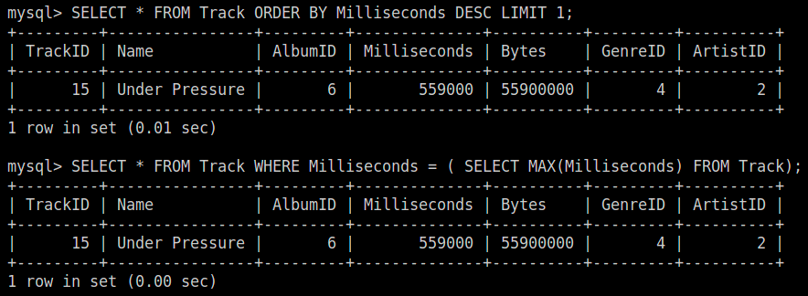
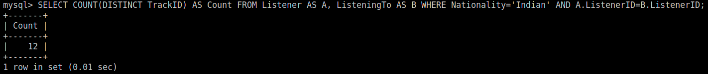
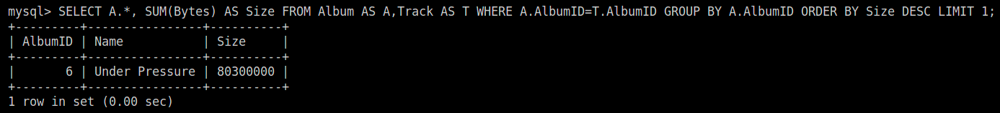
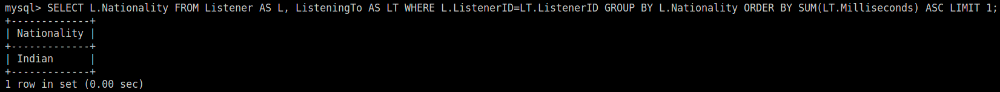
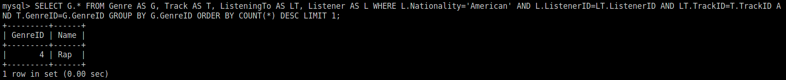
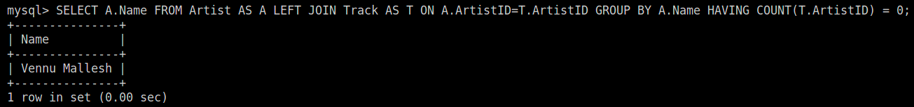
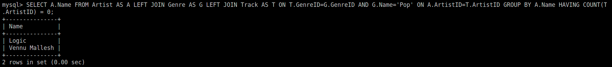

# <center> Data And Applications
# <center> Homework - 3

### <div style="text-align: right"> Abhinav Reddy Boddu
#### <div style="text-align: right"> 2021101034
### <div style="text-align: right"> Rohit Gowlapalli
#### <div style="text-align: right"> 2021101113
### <div style="text-align: right"> Gnana Prakash Punnavajhala
#### <div style="text-align: right"> 2021111027

<hr>

## `Note:` All the queries are single line (no nested queries) commands written in multiple lines just for readability purposes.

## <ins>Query 1</ins>:

- Which Track Has Longest Length?

    ```sql
    SELECT *
    FROM Track
    ORDER BY Milliseconds DESC
    LIMIT 1;
    ```
    (or)
    ```sql
    SELECT *
    FROM Track
    WHERE Milliseconds = (
        SELECT MAX(Milliseconds)
        FROM Track
    );
    ```

- `Approach 1`:
    - Select all columns from `Track`
    - Arrange them in descending order of `Milliseconds`
    - Limit the output to 1 row, i.e., the row having the highest value of `Milliseconds`

- `Approach 2`:
    - Select maximum `Milliseconds` from `Track`
    - Print all rows of the table `Track` where `Milliseconds` is the maximum
    
    <br>

    </img>

<hr>

## <ins>Query 2</ins>:

- How many audio tracks were listened to by the people of "Indian" nationality?
    ```sql
    SELECT COUNT(DISTINCT TrackID) AS Count
    FROM Listener AS A,
        	ListeningTo AS B
    WHERE A.Nationality='Indian'
        	AND A.ListenerID=B.ListenerID;
    ```

- `Approach`:
    - Select only `Nationality` = "Indian" From `Listener` table
    - Select all the appropriate rows in the `ListeningTo` table with `ListenerID` as a foreign key
    - Count the number of distinct tracks

    <br>

    </img>

<hr>

## <ins>Query 3</ins>:

- Which album takes up the maximum space?
    ```sql
    SELECT A.*,
            SUM(Bytes) AS Size
    FROM Album AS A,
            Track AS T
    WHERE A.AlbumID=T.AlbumID
    GROUP BY A.AlbumID
    ORDER BY Size DESC
    LIMIT 1;
    ```

- `Approach`:
    - Select tables `Album` and `Track` with AlbumID as foreign key.
    - Group by `AlbumID` and calculate the sum of `Bytes` of a given album
    - Order the selected rows in the descending order of sum of bytes.
    - Limit the selected rows to be displayed to 1 to get the album of highest bytes, i.e., maximum space

    <br>

    </img>

<hr>

## <ins>Query 4</ins>:

- Which nationality listens to music the least?
    ```sql
    SELECT L.Nationality
    FROM Listener AS L,
            ListeningTo AS LT
    WHERE L.ListenerID=LT.ListenerID
    GROUP BY L.Nationality
    ORDER BY SUM(LT.Milliseconds) ASC
    LIMIT 1;
    ```

- `Approach`:
    - Select `Listener` and `ListeningTo` using `ListenerID` as Foreign key
    - Group by `Nationality`
    - Order by the sum of `Time` for a given nationality
    - Limit the selected rows to be displayed to 1 to get the nationality having lowest listening time.

    <br>

    </img>

<hr>

## <ins>Query 5</ins>:

- Which genre is listened to by the most people among "Americans"?
    ```sql
    SELECT G.*
    FROM Genre AS G,
            Track AS T,
            ListeningTo AS LT,
            Listener AS L
    WHERE L.Nationality='American'
            AND L.ListenerID=LT.ListenerID
            AND LT.TrackID=T.TrackID
            AND T.GenreID=G.GenreID
    GROUP BY G.GenreID
    ORDER BY COUNT(*) DESC
    LIMIT 1;
    ```

- `Approach`:
    - Select all columns in `Genre` from `Genre`, `Track`, `ListeningTo` and `Listener` tables using `Nationality`, `ListenerID`, `TrackID`, `GenreID` as foreign keys.
    - Group them using `GenreID` 
    - Order them by the number of times each genre is appearing in the table from highest to lowest, i.e., descending order
    - Limit the selected rows to be displayed to 1 to get the genre that appeared the most number of times

    <br>

    </img>

<hr>

## <ins>Query 6</ins>:

- Which artist did not make any albums at all?
    ```sql
    SELECT A.*
    FROM Artist AS A
    LEFT JOIN Track AS T
            ON A.ArtistID=T.ArtistID
    GROUP BY A.ArtistID
            HAVING COUNT(T.ArtistID) = 0;
    ```

- `Approach`:
    - Select all columns in `Artist` from `Artist` and `Track` using `ArtistID` as foreign key (mandating every artist to appear using left join).
    - Group by `ArtistID`
    - Print all artists who have `0` rows in the `Track` table, which can be obtained by using the condition `COUNT(T.ArtistID) = 0`

    <br>

    </img>

<hr>

## <ins>Query 7</ins>:

- Which artists did not record any tracks of the "Pop" Genre type?
    ```sql
    SELECT A.Name
    FROM Artist AS A
    LEFT JOIN Genre AS G LEFT JOIN Track AS T
            ON T.GenreID=G.GenreID AND G.Name='Pop' ON A.ArtistID=T.ArtistID
    GROUP BY A.ArtistID
            HAVING COUNT(T.ArtistID) = 0;
    ```

- `Approach`:
	- Left Join the table `Genre` to `Track` where `GenreID` in `Genre` and `Track` tables are same and the `Genre` is `Pop` after which left join the `Artist` table to this table where `ArtistID` in both the tables are same
	- Group by `ArtistID` and select the artists which did not appear in the first table 
    
    <br>

    </img>

<hr>